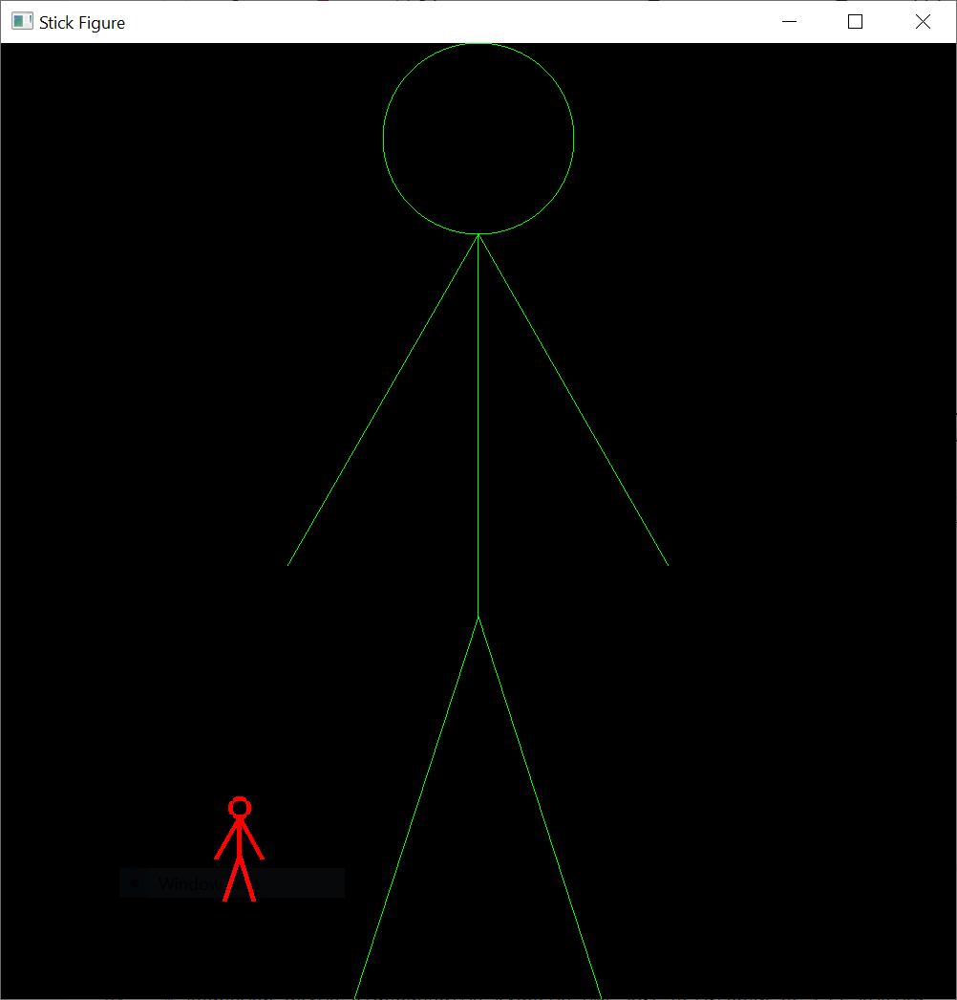

# Εαρινό εξάμηνο 2019-2020

<!-- [ΟΡΓΑΝΩΣΗ ΜΑΘΗΜΑΤΟΣ ΕΑΡΙΝΟ 2019-2020](./resources/oop_spring_2019_2020.pdf) -->

## ΒΑΣΙΚΕΣ ΓΝΩΣΕΙΣ ΠΟΥ ΘΑ ΧΡΕΙΑΣΤΟΥΝ ΣΤΙΣ ΕΞΕΤΑΣΕΙΣ

* Χειρισμός δεικτών, δέσμευσης/αποδέσμευσης μνήμης
* Δημιουργία κλάσεων και αντικειμένων
* Κατανόηση σημασίας προσδιοριστών private, public και protected
* Ορισμός κατασκευαστών και καταστροφέων
* Υπερφόρτωση τελεστών (π.χ. του τελεστή <)
* Κληρονομικότητα - πολυμορφικές ιεραρχίες (virtual) - παράκαμψη (override)
* Προγραμματισμός με πρότυπα (template programming)
* STL περιέκτες (π.χ. std::vector)
* STL αλγόριθμοι (π.χ. std::sort)
* STL επαναλήπτες (π.χ. forward iterator)
* Ανάγνωση απλών διαγραμμάτων κλάσεων UML και μετατροπή σε C++ κώδικα

<!-- ~~[Αναλυτικά η ύλη της προόδου](./proodos.md)~~ -->

[Αναλυτικά η ύλη της τελικής εξέτασης Ιουνίου 2020](./final.md)

## ΘΕΩΡΙΑ

* [Παρουσίαση 1 - Εισαγωγή](./OOP1.pdf) 20/03/2020
* [Παρουσίαση 2 - Επίπεδα προστασίας, κατασκευαστές](./OOP2.pdf) 26/03/2020
* [Παρουσίαση 3 - Περιβάλλον Unix και μεταγλώττιση](./OOP3.pdf) 27/03/2020
* [Παρουσίαση 4 - friend, κατασκευαστές μετατροπής, destructors](./OOP4.pdf) 02/04/2020
* [Παρουσίαση 5 - const](./OOP5.pdf) 03/04/2020
* [Παρουσίαση 6 - Υπερφόρτωση τελεστών](./OOP6.pdf) 03/04/2020
* [Παρουσίαση 7 - Σύνθεση](./OOP7.pdf) 09/04/2020
* [Παρουσίαση 8 - Πίνακες αντικειμένων](./OOP8.pdf) 09/04/2020
* [Παρουσίαση 9 - Δείκτες](./OOP9.pdf) 10/04/2020
* [Παρουσίαση 10 - Δυναμική δέσμευση μνήμης](./OOP10.pdf) 10/04/2020
* [Παρουσίαση 11 - Αναδρομή](./OOP11.pdf) 15/05/2020
* [Παρουσίαση 12 - Κατασκευαστής αντιγραφής και αντιγραφή μέσω ανάθεσης](./OOP12.pdf) 30/4/2020
* [Παρουσίαση 13 - Λεκτικά, υπερφόρτωση του τελεστή [] και του τελεστή &](./OOP13.pdf) 28/5/2020
* [Παρουσίαση 14 - Κληρονομικότητα](./OOP14.pdf) 23/04/2020
* [Παρουσίαση 15 - Πολυμορφισμός και ιδεατές συναρτήσεις](./OOP15.pdf) 24/04/2020
* [Παρουσίαση 16 - Πρότυπα](./OOP16.pdf) 10/05/2020
* [Παρουσίαση 17 - Συνδεδεμένες λίστες](./OOP17.pdf) 07/05/2020
* [Παρουσίαση 18 - Εξαιρέσεις](./OOP18.pdf) 14/05/2020
* [Παρουσίαση 19 - Χρήσιμες έννοιες στη C++ και μερικές ακόμα δομές δεδομένων](./OOP19.pdf) 28/5/2020
  
Οι παραπάνω παρουσιάσεις αποτελούν προσαρμογή υλικού που έχει αναπτυχθεί από τους Robert Myers, Matthew Small, Xin Yuan στα πλαίσια μαθημάτων για τον αντικειμενοστραφή προγραμματισμό με τη C++ [COP3330/CGS5409: Object-oriented Programming in C++](http://www.cs.fsu.edu/~xyuan/cop3330/).

### Επιπλέον παρουσιάσεις

* [Δείκτες στη C και στη C++](https://github.com/chgogos/ceteiep_dsa/blob/master/appendix_pointers/Pointers%20in%20C%20and%20C%2B%2B.pdf)
* [STL](./STL.pdf)

### BONUS

Η ολοκλήρωση της παρακολούθησης του Tutorial της Sololearn για τη C++  <https://www.sololearn.com/Course/CPlusPlus/> και η λήψη του αντίστοιχου δωρεάν διαθέσιμου πιστοποιητικού μέχρι τις ~~30/4/2020~~
δίνει τη δυνατότητα +1 βαθμού bonus στη θεωρία του μαθήματος με τις ακόλουθες προϋποθέσεις:

1. Ο βαθμός της τελικής εξέτασης στη θεωρία του μαθήματος στο τέλος του εξαμήνου να είναι από 5 και άνω.
2. Απάντηση ενδεικτικών ερωτήσεων μέσω του MSTEAMS με "ανοικτή κάμερα" έτσι ώστε να διαπιστωθεί ότι ο χρόνος λήψης του πιστοποιητικού που επενδύθηκε από τον φοιτητή ή την φοιτήτρια είχε τα αναμενόμενα αποτελέσματα.

## ΕΡΓΑΣΤΗΡΙΑ

* [lab2020](./lab2020/)
* [Εκφωνήσεις ασκήσεων εργαστηρίου](./lab2020/lab_exercises.md)

## ΕΡΓΑΣΙΕΣ ΕΡΓΑΣΤΗΡΙΟΥ

* [1η εργασία - εκφώνηση](./lab2020/exercise1/20200217_assignment1.pdf) προθεσμία παράδοσης: ~~8/3/2020~~
  * Λύση
    * [account_bank.cpp](./lab2020/exercise1_solution/account_bank.cpp)
  * Δεύτερη λύση με διαμέριση κώδικα
    * [account_bank.hpp](./lab2020/exercise1_solution2/account_bank.hpp)
    * [account_bank.cpp](./lab2020/exercise1_solution2/account_bank.cpp)
    * [main.cpp](./lab2020/exercise1_solution2/main.cpp)
    * [tests.cpp](./lab2020/exercise1_solution2/tests.cpp)
    * [catch.hpp](./lab2020/catch.hpp)
* [2η εργασία - εκφώνηση](./lab2020/exercise2/20200310_assignment2.pdf) προθεσμία παράδοσης: ~~30/4/2020~~
  * Λύση
    * [linked_list.hpp](./lab2020/exercise2_solution/linked_list.hpp)
    * [linked_list.cpp](./lab2020/exercise2_solution/linked_list.cpp)
    * [main.cpp](./lab2020/exercise2_solution/main.cpp)
    * [tests.cpp](./lab2020/exercise2_solution/tests.cpp)
    * [catch.hpp](./lab2020/catch.hpp)
* [3η εργασία - εκφώνηση](./lab2020/exercise3/20200423_assignment3.pdf) προθεσμία παράδοσης: ~~17/5/2020~~
  * [academic_year_2019_2020_semester4.txt](./lab2020/exercise3/academic_year_2019_2020_semester4.txt)
  * [academic_year_2019_2020_semester4_windows1253.txt](./lab2020/exercise3/academic_year_2019_2020_semester4_windows1253.txt)
  * [Λύση 3ης εργασίας](./lab2020/exercise3_solution/README.md)
* [4η εργασία - εκφώνηση](./lab2020/exercise4/20200520_assignment4.pdf) προθεσμία παράδοσης: ~~31/5/2020~~
  * Σχεδίαση stick figure <https://github.com/chgogos/oop/tree/master/lab2020/lab_ex7_sol>
  * 
  * [Λύση 4ης εργασίας](./lab2020/exercise4_solution/README.md)
  * [Δεύτερη λύση 4ης εργασίας](./lab2020/exercise4_solution2/README.md)

### Βαθμοί εργασιών εργαστηρίου

* [Βαθμοί εργασιών 1+2+3+4](./lab2020/ΒΑΘΜΟΙ_ΕΡΓΑΣΙΩΝ_ΕΡΓΑΣΤΗΡΙΟΥ_2020.pdf)
