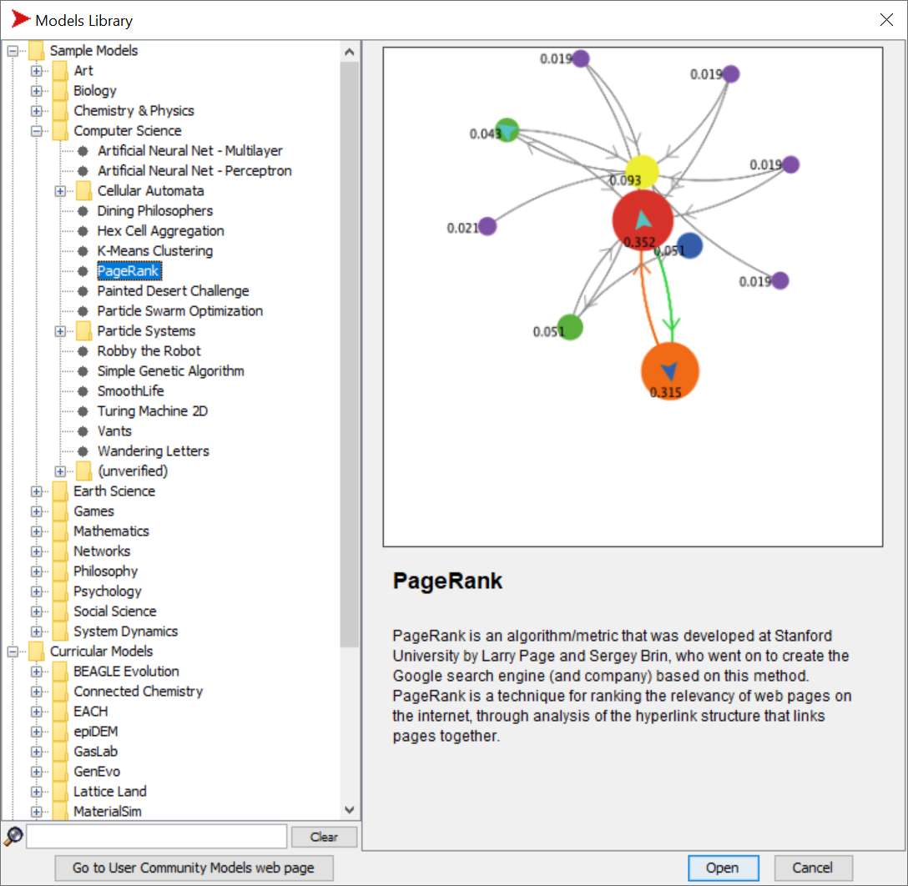

# Εργασία χειμερινού εξαμήνου 2020-2021 - Random Surfer

  * [Εκφώνηση εργασίας (pdf)](Εργασία%202020-2021.pdf)

Έστω ένα σύνολο από ιστοσελίδες που μπορεί να περιέχουν συνδέσμους η μια προς την άλλη. Θέλουμε να αξιολογήσουμε τη σχετική σημασία κάθε ιστοσελίδας αποδίδοντας της έναν βαθμό που θα είναι στο διάστημα [0,1] ενώ το άθροισμα των βαθμών από όλες τις ιστοσελίδες να ισούται με 1. Η απόδοση βαθμού σε κάθε ιστοσελίδα θα γίνεται έτσι ώστε να αποδίδεται υψηλότερος βαθμός σε ιστοσελίδες που έχουν μεγάλο αριθμό εισερχόμενων συνδέσεων από σημαντικές ιστοσελίδες, δηλαδή ιστοσελίδες που έχουν υψηλό βαθμό. 

<https://ccl.northwestern.edu/netlogo/models/PageRank>

Ο τρόπος υπολογισμού του βαθμού κάθε ιστοσελίδας θα γίνεται μέσω του αλγορίθμου random surfer που περιγράφεται στη συνέχεια. Έστω ότι υπάρχει μια ομάδα από επισκέπτες ιστοσελίδων που το μόνο που κάνουν είναι να πλοηγούνται από μια ιστοσελίδα στην άλλη κάνοντας κλικ στον ένα υπερδεσμό μετά τον άλλο. Δεν διαβάζουν το περιεχόμενο της ιστοσελίδας αλλά θεωρητικά παραμένουν για ένα μικρό διάστημα στην κάθε ιστοσελίδα πριν μετακινηθούν σε μια άλλη. Μερικές φορές αντί να ακολουθήσουν έναν σύνδεσμο, επιλέγουν να πηδήξουν σε μια άλλη σελίδα εντελώς τυχαία. Η πιθανότητα να συμβεί αυτό καθορίζεται από την παράμετρο DAMPING-FACTOR που υποθετικά θα μπορούσε να έχει την τιμή 0,85 και σε αυτή την περίπτωση θα σήμαινε ότι με πιθανότητα 100%-85%=15% ο επισκέπτης θα επιλέξει να μετακινηθεί σε μια εντελώς τυχαία σελίδα αντί να ακολουθήσει κάποιον από τους υπερδεσμούς της σελίδας στην οποία βρίσκεται. Επίσης, οι επισκέπτες επιλέγουν να πηδήξουν σε μια νέα τυχαία σελίδα αν βρεθούν σε αδιέξοδο, δηλαδή σε κάποια ιστοσελίδα που δεν έχει εξερχόμενες συνδέσεις. Για κάθε ιστοσελίδα καταγράφεται ο αριθμός των επισκέψεων που έχει λάβει και ο βαθμός της υπολογίζεται διαιρώντας τον αριθμό αυτό με το συνολικό αριθμό των επισκέψεων που έχουν γίνει σε όλες τις ιστοσελίδες. Όταν ολοκληρωθεί ο υπολογισμός των βαθμών υπολογίζεται η κατάταξή των ιστοσελίδων έτσι ώστε η ιστοσελίδα με τον υψηλότερο βαθμό να λαμβάνει τον αριθμό κατάταξης 1, η ιστοσελίδα με το δεύτερο υψηλότερο βαθμό να λαμβάνει τον αριθμό κατάταξης 2 κ.ο.κ. 

## Ερωτήματα εργασίας

Ζητείται η συγγραφή τεχνικής αναφοράς για την εργασία που να παρουσιάζει το πρόβλημα, τον αλγόριθμο random surfer και τα αποτελέσματα της εκτέλεσης του κώδικα. Επιπλέον της τεχνικής αναφοράς, ζητούμενα της εργασίας είναι και τα ακόλουθα.
1. Γράψτε πρόγραμμα ακολουθώντας αρχές του αντικειμενοστραφούς προγραμματισμού που για έναν αριθμό ιστοσελίδων με τυχαίες συνδέσεις μεταξύ τους να υπολογίζει το βαθμό και την κατάταξη της κάθε ιστοσελίδας. Εκτελέστε το πρόγραμμά σας με αριθμό ιστοσελίδων Ν=10, αριθμό επισκεπτών=3, DAMPING-FACTOR=0.85 και τρέξτε τον αλγόριθμο μέχρι οι βαθμοί των ιστοσελίδων να συγκλίνουν. Εμφανίστε την κατάταξη των ιστοσελίδων που προκύπτει. [60%]
2. Δημιουργήστε ένα GUI (Graphical User Interface) από το οποίο να οδηγείται η εκτέλεση του προγράμματος και μέσω του οποίου ο χρήστης να μπορεί να αλλάξει τον αριθμό των σελίδων, τον αριθμό των επισκεπτών και το DAMPING-FACTOR και να εμφανίζει τα αποτελέσματα σε ένα multi-line πεδίο του GUI. [20%]
3. Δημιουργήστε ένα διάγραμμα που για αριθμό επισκεπτών=3 να απεικονίζει το βαθμό της δημοφιλέστερης ιστοσελίδας για N={10,15,20,…, 1000} και για DAMPING-FACTOR={0.50, 0.51,…,0.99}. Επαναλάβετε για αριθμό επισκεπτών=5 και για αριθμό επισκεπτών=10. [20%]