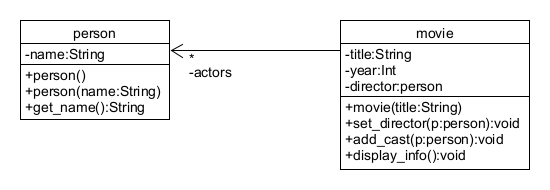

# Θέματα προετοιμασίας 2 - Άσκηση 1

[Εκφώνηση](./../../../preparation/telikes.pdf)

## Κώδικας

* [Main.java](./src/Main.java)
* [Movie.java](./src/Movie.java)
* [Person.java](./src/Person.java)

## Μεταγλώττιση και εκτέλεση

Ο κώδικας είναι εφαρμογή στο Eclipse for Java και βρίσκεται στον φάκελο [prepare04](https://github.com/chgogos/oop/tree/master/lab2020-2021/lab06/prepare02a)

Eclipse: Run -> Run

Movie1 directed by Director 1
Cast:
Actor 1
Actor 2
Movie2 directed by Director 2
Cast:
Actor 2
Actor 3
