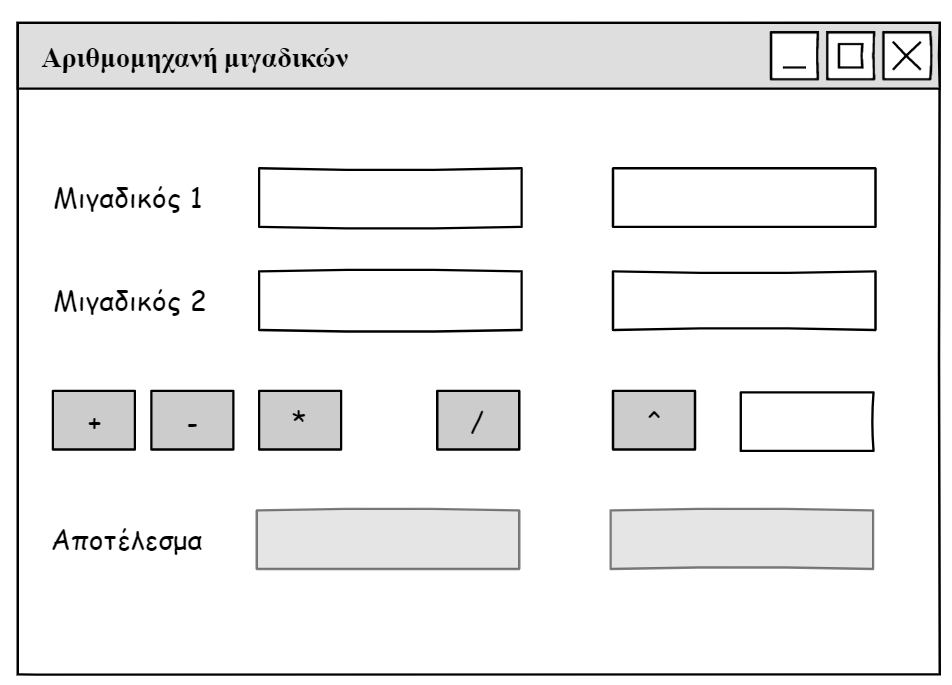
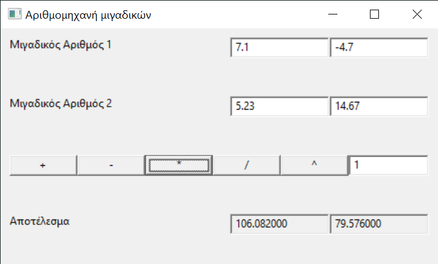

# Λύση άσκησης

* [Complex.hpp](./Complex.hpp)
* [Complex.cpp](./Complex.cpp)
* [Main.cpp](./Main.cpp)
* [speedup.cpp](./speedup.cpp)
* [Tests.cpp](./Tests.cpp)
* [BaseFrame.hpp](./BaseFrame.hpp)
* [BaseFrame.cpp](./BaseFrame.cpp)
* [GUI.cpp](./GUI.cpp)

## Μεταγλώττιση και εκτέλεση του Console app

    $ g++ Complex.cpp Main.cpp -o Main -std=c++14
    Example of operator<<
    5 + 3i
    Conjugate
    5 - 3i
    Magnitude
    5.83095
    Example of operator+
    7 - 1i
    Example of operator-
    3 + 7i
    Example of operator*
    22 - 14i
    Example of operator/
    -0.1 + 1.3i
    Example of operator==
    NOT EQUAL
    Example of operator!=
    EQUAL
    Example of raising a complex number to a positive integer power
    122 - 597i
    Example of raising a complex number to a negative integer power
    0.000328581 + 0.00160789i

## Μεταγλώττιση και εκτέλεση των Tests

Για επιτάχυνση της μεταγλώττισης των tests

    $ g++ -c speedup.cpp -o speedup.o -std=c++14

Μεταγλώττιση και εκτέλεση των tests

    $ g++ Complex.cpp Tests.cpp speedup.o -o Tests -std=c++14
    $ Tests.exe                                                     
    ===============================================================================
    All tests passed (21 assertions in 9 test cases)                               

## Μεταγλώττιση και εκτέλεση του GUI

Mockup 

Εντολές μεταγλώττισης και εκτέλεσης

    $ g++ Complex.cpp Baseframe.cpp GUI.cpp -IC:\\wxWidgets-3.1.4\\include -IC:\\wxWidgets-3.1.4\\lib\\gcc_dll\\mswu -LC:\\wxWidgets-3.1.4\\lib\\gcc_dll -lwxmsw31u_core -lwxbase31u -o GUI
    $ GUI.exe

