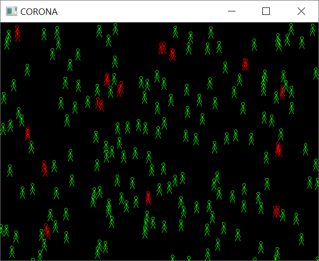

# Λύση 4ης εργασίας

## Κώδικας

* <https://github.com/chgogos/oop/tree/master/lab2020/exercise4_solution>

## Μεταγλώττιση και εκτέλεση κώδικα (Windows)

* Εγκαταστήστε το [Make for Windows](http://gnuwin32.sourceforge.net/packages/make.htm) για να έχετε πρόσβαση στο make στα Windows.

```sh
$ make -f makefile_win.mk
g++ main.cpp -o main -Idependencies/include -Ldependencies/lib-mingw-w64 -std=c++14 -O2 -lglfw3 -lopengl32 -lgdi32 -luser32 -lkernel32
$ main.exe 200
[215.069,374.099] is nearby with 1 persons
[558.123,107.38] is nearby with 1 persons
[566.692,344.376] is nearby with 1 persons
[89.8496,189.81] is nearby with 1 persons
[491.068,403.716] is nearby with 1 persons
[195.95,325.848] is nearby with 1 persons
[54.815,261.842] is nearby with 1 persons
[494.106,403.945] is nearby with 1 persons
[552.598,106.18] is nearby with 1 persons
[347.457,422.974] is nearby with 1 persons
[91.6243,71.2579] is nearby with 1 persons
[213.497,371.846] is nearby with 1 persons
[87.5193,198.691] is nearby with 1 persons
[33.6911,471.37] is nearby with 1 persons
[297.166,136.455] is nearby with 1 persons
[344.275,424.476] is nearby with 1 persons
[322.482,435.195] is nearby with 1 persons
[203.206,320.431] is nearby with 1 persons
[297.634,131.945] is nearby with 1 persons
[562.408,229.241] is nearby with 2 persons
[238.932,350.305] is nearby with 1 persons
[328.676,436.882] is nearby with 1 persons
[242.97,357.555] is nearby with 1 persons
[34.8021,461.664] is nearby with 1 persons
[54.6283,266.612] is nearby with 1 persons
[558.46,236.244] is nearby with 2 persons
[567.182,350.414] is nearby with 1 persons
[95.4263,62.8982] is nearby with 1 persons
[557.942,231.03] is nearby with 2 persons
People at risk 29
```



## Μεταγλώττιση και εκτέλεση κώδικα (Linux)

```sh
$ make -f makefile_linux.mk
```

## Μεταγλώττιση και εκτέλεση κώδικα (OSX)

```sh
$ make -f makefile_osx.mk
```
