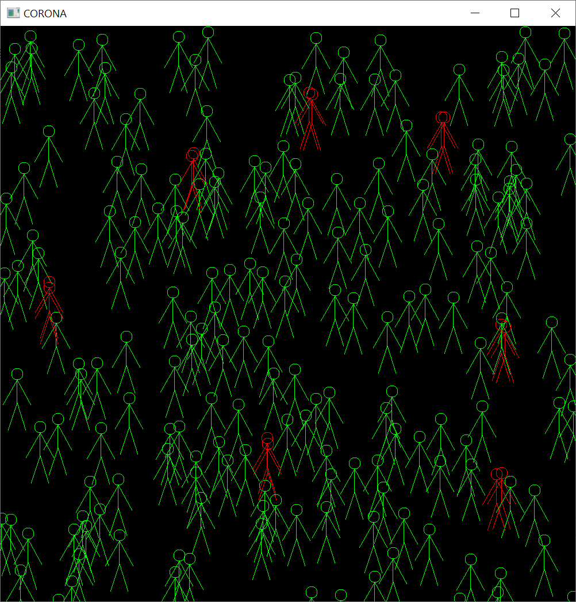

# Λύση 4ης εργασίας

## Κώδικας

* <https://github.com/chgogos/oop/tree/master/lab2020/exercise4_solution2>

## Μεταγλώττιση και εκτέλεση κώδικα (Windows)

* Εγκαταστήστε το [Make for Windows](http://gnuwin32.sourceforge.net/packages/make.htm) για να έχετε πρόσβαση στο make στα Windows.

```sh
$ make -f makefile_win.mk
g++ main.cpp -o main -Idependencies/include -Ldependencies/lib-mingw-w64 -std=c++14 -O2 -lglfw3 -lopengl32 -lgdi32 -luser32 -lkernel32
$ main.exe 200
$ main 200
[336.045,779.372] is nearby with 1 persons
[872.067,223.708] is nearby with 1 persons
[767.294,841.075] is nearby with 1 persons
[85.6484,545.504] is nearby with 1 persons
[772.041,841.552] is nearby with 1 persons
[863.434,221.207] is nearby with 1 persons
[542.901,881.195] is nearby with 1 persons
[333.589,774.679] is nearby with 1 persons
[464.322,284.281] is nearby with 1 persons
[537.93,884.326] is nearby with 1 persons
[465.053,274.885] is nearby with 1 persons
[878.762,477.585] is nearby with 1 persons
[85.3567,555.442] is nearby with 1 persons
[871.784,481.313] is nearby with 1 persons
People at risk 14
```



## Μεταγλώττιση και εκτέλεση κώδικα (Linux)

```sh
$ make -f makefile_linux.mk
```

## Μεταγλώττιση και εκτέλεση κώδικα (OSX)

```sh
$ make -f makefile_osx.mk
```
